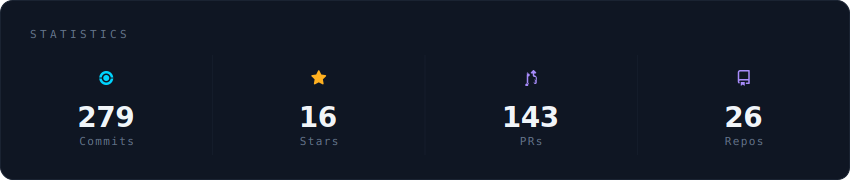

<!-- Galaxy Profile README Template
     Customize this file with your own info, then rename it to README.md
     in your GitHub profile repo (github.com/YOUR_USERNAME/YOUR_USERNAME).
     The SVG paths below point to assets/generated/ which are auto-generated
     by the GitHub Actions workflow or by running: python -m generator.main -->

  

 

  

 

  

 

  

 

 

## Sobre mim

-  Cursando atualmente o 9º semestre de Engenharia da Computação na Universidade Federal da Bahia. 
-  Focado no desenvolvimento de softwares escaláveis e de alta performance, comprometido em aplicar os melhores princípios de programação para criar soluções robustas e manuteníveis. 
-  Visão de futuro direcionada no parofundamente em conceitos teóricos fundamentais para a base da computação além da aplicação de LLMs como agentes de solução de problemas comuns da sociedade.

## Minhas Skills

### 💻 Linguagens

### 🎨 Front-end

### ⚙️ Back-end

### 🔧 Ferramentas gerais

### 🖥️ Sistemas Operacionais

## Contato

